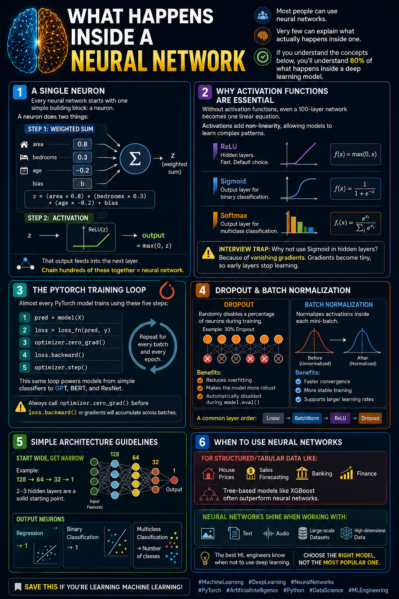

# Neural Networks & PyTorch



## Overview

Today, in my AI learning journey, I moved from learning the mathematics behind machine learning to building a working neural network with **PyTorch**. I created an end-to-end regression pipeline that predicts house prices, from feature engineering and preprocessing through training, evaluation, and visualization.

This project helped me connect matrix multiplication, activation functions, gradients, the chain rule, and optimization inside one complete neural-network training loop.

## Project Files

| File | Description |
| --- | --- |
| [`Neural_Networks_PyTorch.ipynb`](./Neural_Networks_PyTorch.ipynb) | Complete PyTorch implementation and experiment |
| [`House_Price_prediction.csv`](./House_Price_prediction.csv) | House-price dataset used by the model |
| [`Day-11.png`](./Day-11.png) | Day 11 project image |

## What I Built

I built a fully connected neural network for house-price regression with the following architecture:

```text
14 input features
      ↓
Linear(14, 64) → ReLU → BatchNorm → Dropout(0.2)
      ↓
Linear(64, 32) → ReLU → BatchNorm → Dropout(0.2)
      ↓
Linear(32, 16) → ReLU
      ↓
Linear(16, 1)
      ↓
Predicted house price
```

The model contains **3,777 trainable parameters**.

## Work Completed

### 1. Data preparation and feature engineering

- Loaded the house-price dataset with pandas.
- Created `House_Age` from the year built.
- Combined bedrooms and bathrooms into `Total_Rooms`.
- Created an `Is_New` indicator for houses under ten years old.
- Created the interaction feature `Area_x_Floors`.
- Ordinally encoded the house condition.
- One-hot encoded location and garage categories.
- Split the data into 80% training and 20% testing sets.
- Standardized both the features and target with `StandardScaler`.
- Converted NumPy arrays into PyTorch tensors and moved them to the available device.

The final training set contained **1,600 samples and 14 input features**.

### 2. Neural-network design

I created a custom `HousePriceNet` class using `nn.Module` and `nn.Sequential`. The hidden layers use ReLU activation functions to learn non-linear patterns. Batch normalization stabilizes the activations, while dropout and weight decay help reduce overfitting.

The output layer has one neuron and no activation function because this is a regression problem.

### 3. Model training

The network was trained for **200 epochs** with mini-batches of 32 samples using:

- `nn.MSELoss()` as the regression loss function
- Adam with a learning rate of `0.001`
- L2 regularization through `weight_decay=1e-4`
- `ReduceLROnPlateau` to lower the learning rate when validation stopped improving
- Gradient clipping with a maximum norm of `1.0`
- Best-model checkpointing based on validation loss

The core training cycle was:

```python
model.train()
optimizer.zero_grad()
predictions = model(X_batch)
loss = criterion(predictions, y_batch)
loss.backward()
torch.nn.utils.clip_grad_norm_(model.parameters(), 1.0)
optimizer.step()
```

### 4. Evaluation and visualization

During evaluation, I switched the model to evaluation mode and disabled gradient tracking. I then transformed predictions back to the original dollar scale and evaluated them with R² and RMSE.

The notebook also visualizes:

- Training loss versus validation loss
- Predicted prices versus actual prices
- The learning-rate schedule across epochs

## Recorded Results

| Metric | Result |
| --- | ---: |
| R² | -0.094 |
| RMSE | $291,680 |

These results show that this particular neural network did not generalize well to the test data. A negative R² means it performed worse than simply predicting the test-set mean. This is still a valuable experiment: neural networks are not automatically the best choice for small, structured tabular datasets, where tree-based models such as Random Forest or XGBoost often perform better.

Possible next improvements include checking the data distributions and outliers, comparing against a mean and linear-regression baseline, tuning the architecture and regularization, using a separate validation set instead of the test set during training, and testing tree-based models on the same split.

## What I Learned

### Neural-network anatomy

- The **input layer** receives the raw features.
- **Hidden layers** learn increasingly useful representations.
- The **output layer** produces the final prediction.
- Each neuron computes a weighted sum, adds a bias, and applies an activation function.

### Activation functions

- **ReLU** is a common default for hidden layers.
- **Sigmoid** is commonly used for binary classification outputs.
- **Softmax** converts logits into a multi-class probability distribution.
- Without non-linear activation functions, multiple linear layers collapse into a single linear transformation.

### Forward pass and backpropagation

In the forward pass, data moves through the layers to produce predictions. The loss function measures prediction error. During backpropagation, PyTorch's autograd applies the chain rule to compute the gradient of the loss with respect to every trainable parameter.

### Why gradients must be cleared

PyTorch accumulates gradients by default. Calling `optimizer.zero_grad()` before each backward pass prevents gradients from previous batches from being added to the current batch's gradients.

### Training and evaluation modes

- `model.train()` enables training behavior for dropout and batch normalization.
- `model.eval()` disables dropout and makes batch normalization use its learned running statistics.
- `torch.no_grad()` avoids unnecessary gradient computation during evaluation, saving memory and computation.

### Regularization and stability

- **Dropout** randomly disables some activations during training to reduce reliance on individual neurons.
- **Batch normalization** keeps activations in a more stable range.
- **Weight decay** penalizes large weights.
- **Gradient clipping** helps prevent exploding gradients.
- A **learning-rate scheduler** reduces the step size when learning stalls.

### Model selection matters

Neural networks are especially powerful for images, text, audio, sequences, and large datasets. They may underperform well-tuned tree-based models on smaller tabular datasets. Choosing the right model family is as important as knowing how to train it.

## Knowledge Check

1. Why are activation functions necessary between neural-network layers?
2. Why must `optimizer.zero_grad()` be called during training?
3. What is the difference between `model.train()` and `model.eval()`?
4. What does it mean when training loss decreases but validation loss increases?
5. Why was the target price scaled and then inverse-transformed?


<details>
<summary><strong>Answer key</strong></summary>

1. Activation functions introduce non-linearity. Without them, a stack of linear layers is mathematically equivalent to one linear transformation and cannot learn complex non-linear relationships.
2. PyTorch accumulates gradients in each parameter. Clearing them before the next backward pass ensures that each update uses only the gradients from the current mini-batch.
3. `model.train()` enables training-specific behavior such as dropout and batch-normalization updates. `model.eval()` disables dropout and makes batch normalization use its saved running statistics, producing consistent predictions during validation or testing.
4. This usually indicates overfitting. The model is learning the training data too closely but is becoming worse at generalizing to unseen data. Possible responses include early stopping, stronger regularization, a smaller network, more data, or improved feature selection.
5. Scaling the target keeps its values and gradients in a manageable range, which can make neural-network optimization more stable. Predictions are inverse-transformed afterward so evaluation metrics and final outputs are expressed in real dollars.

   </details>

## Key Takeaway

Every neural network follows the same essential process: make a forward pass, measure the loss, clear old gradients, backpropagate the error, and update the weights. Day 11 gave me practical experience with that full process and showed me that evaluating whether a neural network is appropriate for the dataset is part of the modeling work.

## Tools and Libraries

- Python
- PyTorch
- pandas
- NumPy
- scikit-learn
- Matplotlib
- Jupyter Notebook

---

**AI Career Path - Day 11 completed ✅**
